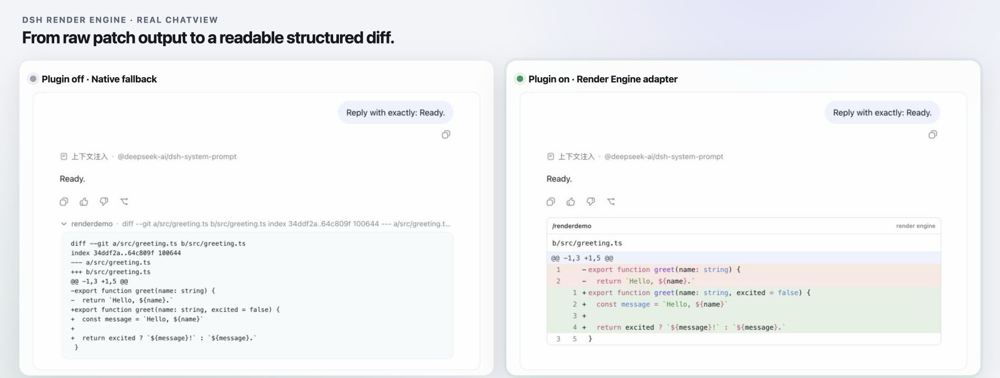
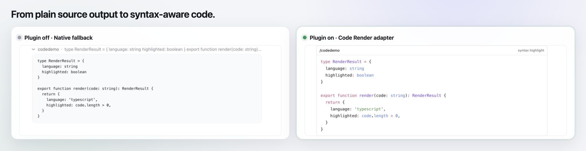
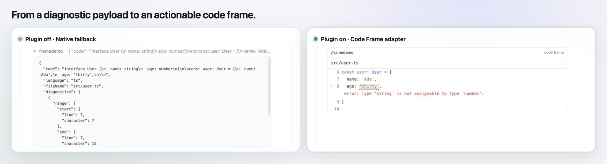
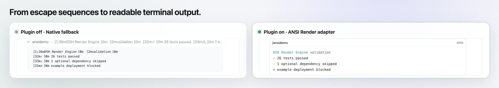

# DSH Render Engine

[English](./README.md) | 简体中文

一个面向 DeepSeek Harness Web 插件的轻量浏览器端渲染服务 monorepo。项目将 Shiki 分词、稳定的语法高亮 token、Markdown、Mermaid 图表、TeX 数学公式、归一化 Diff、诊断代码框、ANSI 终端输出和安全 HTML 渲染拆分为十个可以独立发布的 npm 包。

## 提供渲染服务，而不是具体前端

十个公开包**不会**附带页面、面板、ChatView 卡片或其他具体前端。它们注册 `ctx.codeRenderer`、`ctx.markdownRenderer`、`ctx.mermaidRenderer`、`ctx.mathRenderer`、`ctx.diffRenderer` 等可复用的浏览器端 Cordis 服务。下游插件自行决定承载界面和交互方式，将自己的数据交给这些服务，并取得可以嵌入目标界面的归一化结构、稳定 token、SVG、MathML，或经过转义且响应主题的 HTML。

下方展示的 ChatView 卡片只属于私有的 `integration/consumer`。它们用于演示公开服务的一种接入方式，并不是随公开渲染器包发布的 UI。

## 在 ChatView 中的效果

左右两侧展开的是同一条持久化 patch。原生 DSH 以纯文本展示；下游适配器调用 `dsh-diff-engine` 和 `dsh-diff-render` 后，可以生成结构化、响应主题并带语法高亮的代码审阅界面。



左右两侧使用同一条持久化命令输出。私有 integration consumer 将公开服务接入真实 DSH 会话插槽，从而可以和原生 fallback 进行对比。

### 更多真实 ChatView 对比

同一段 TypeScript 源码从已展开的纯文本命令结果，变为紧凑并带语法高亮的代码界面。



原始诊断请求被转换为聚焦的 Code Frame，直接呈现源码上下文、行号、下划线范围，以及紧邻出错行的诊断消息。



ANSI 控制序列被解释为可读的终端颜色和强调样式，同时保持原始文本不变。



## 包结构

| 包 | Cordis 服务 | 职责 |
| --- | --- | --- |
| `@ch4acko3/dsh-shiki` | `ctx.shiki` | 管理一个共享的 Shiki 引擎和内置语言集合。 |
| `@ch4acko3/dsh-syntax-highlight` | `ctx.syntaxHighlighter` | 将源码转换为稳定、响应主题的 token；无法识别语言时回退为纯文本。 |
| `@ch4acko3/dsh-code-render` | `ctx.codeRenderer` | 将高亮 token 转换为经过转义的 HTML 代码块。 |
| `@ch4acko3/dsh-markdown-render` | `ctx.markdownRenderer` | 将不受信任的 GFM 渲染为经过清洗、响应主题的 HTML，并把代码围栏交给 `ctx.codeRenderer`。 |
| `@ch4acko3/dsh-mermaid-render` | `ctx.mermaidRenderer` | 将不受信任的 Mermaid 定义渲染为经过清洗的 SVG。 |
| `@ch4acko3/dsh-math-render` | `ctx.mathRenderer` | 使用 KaTeX 将 TeX 表达式渲染为可访问的原生 MathML。 |
| `@ch4acko3/dsh-code-frame-render` | `ctx.codeFrameRenderer` | 渲染带诊断范围和消息的源码上下文。 |
| `@ch4acko3/dsh-diff-engine` | `ctx.diffEngine` | 将完整文件快照、DSH 文件差异和 unified patch 归一化为统一文档。 |
| `@ch4acko3/dsh-diff-render` | `ctx.diffRenderer` | 将归一化 Diff 渲染为经过转义并带源码语法高亮的 HTML。 |
| `@ch4acko3/dsh-ansi-render` | `ctx.ansiRenderer` | 将 ANSI 终端输出转换为经过转义、自包含的 HTML。 |

依赖方向保持单向：

```text
dsh-code-render -------+--> dsh-syntax-highlight --> dsh-shiki
dsh-markdown-render -----> dsh-code-render
        + - - 可选 -----> dsh-mermaid-render
        + - - 可选 -----> dsh-math-render
dsh-code-frame-render -+
dsh-diff-render ---------> dsh-diff-engine
        +-----------------> dsh-syntax-highlight
dsh-ansi-render             （独立）
dsh-mermaid-render          （独立）
dsh-math-render             （独立）
```

仓库根包和 `integration/consumer` 均为私有包。只有 `packages/` 下的十个包计划对外发布。

## 功能

- 多个 DSH Web 插件共享一个延迟初始化的 Shiki 引擎。
- 提供不依赖 Shiki 内部 token 结构的稳定数据模型。
- 在每一层服务中保留原始 LF、CRLF 和 CR 换行符。
- 使用 CSS 变量输出颜色，跟随 DSH 主题。
- 语言未提供或不受支持时自动回退为纯文本。
- 生成 HTML 时转义源码内容。
- 安全渲染 GitHub Flavored Markdown：原始 HTML 作为文本显示，代码围栏复用共享代码渲染器。
- 使用 Mermaid 严格安全设置生成并再次清洗 SVG 图表。
- 将 TeX 渲染为原生 MathML，无需额外样式表或字体文件。
- 显式支持完整文件、DSH `FileDiff` 片段、unified 或 Git patch 三种 Diff 输入。
- 使用一个稳定 Diff 文档表达文件、hunk、行、状态、源码完整度和统计信息。
- 在增删、上下文和元数据行的语义样式上叠加源码语言 token 颜色。
- 使用与 LSP position 兼容的零基 UTF-16 范围渲染诊断代码框，但不依赖 LSP。
- 安全渲染 ANSI SGR、16 色、256 色、真彩色和 allowlist 内的终端超链接。
- 提供私有交互式预览，可在真实 DSH 浏览器运行时中查看代码、诊断、Diff、ANSI、token 和 HTML。

内置语言：Bash、C、C++、CSS、Diff、Go、HTML、Java、JavaScript、JSX、JSON、Markdown、Python、Rust、SQL、TSX、TypeScript 和 YAML。支持 `sh`、`js`、`md`、`patch`、`py`、`rs`、`ts`、`yml`、`zsh` 等常见别名。

## 环境要求

- Node.js `^22.22.3 || >=24.11.1`
- pnpm `11.19.0`
- 在 DSH Web 中加载插件时需要 DeepSeek Harness `0.1.0-rc.8`

## 本地开发

```sh
pnpm install
pnpm check
```

`pnpm check` 会构建所有 workspace 包、执行 TypeScript 检查并运行单元测试。

## 使用服务

插件只需声明自己直接使用的服务，Cordis 会沿包依赖链加载其余服务。

```ts
export const inject = ['codeRenderer']

export function apply(ctx) {
  const result = ctx.codeRenderer.render({
    code: 'const answer: number = 42',
    language: 'ts',
  })

  console.log(result.language)    // "typescript"
  console.log(result.highlighted) // true
  console.log(result.html)        // 已转义、响应主题的 HTML
}
```

需要结构化数据时，可以直接使用更底层的服务：

```ts
const raw = ctx.shiki.tokenize({ code, language: 'ts' })
const highlighted = ctx.syntaxHighlighter.highlight({ code, language: 'ts' })
```

`ctx.shiki.tokenize()` 要求传入受支持的语言。`ctx.syntaxHighlighter.highlight()` 和 `ctx.codeRenderer.render()` 可以接收缺失或未知的语言，并返回未高亮的纯文本结果。

不绑定具体 ChatView 或文件浏览器，直接渲染不受信任的 Markdown：

```ts
const renderedMarkdown = await ctx.markdownRenderer.render({
  markdown: '# Result\n\n```ts\nconst answer = 42\n```',
})

console.log(renderedMarkdown.html)
```

Markdown 服务支持 GFM 表格、任务列表、删除线、行内 `$…$`、块级 `$$…$$`，以及 `math`/`latex`/`tex`/`katex` 围栏。它会把原始 HTML 显示为文本，清洗生成的链接与图片，并将普通代码围栏交给 `ctx.codeRenderer`。渲染时动态检查 `ctx.get('mermaidRenderer')` 和 `ctx.get('mathRenderer')`：可选服务存在就升级，不存在就保留可读的源码回退；Markdown 包本身不依赖 Mermaid 或 KaTeX。

不经过 Markdown 时，也可以直接调用可选富内容渲染器：

```ts
const diagram = await ctx.mermaidRenderer.render({ source: 'graph TD\n  A --> B' })
const formula = ctx.mathRenderer.render({ source: String.raw`e^{i\pi} + 1 = 0` })
```

完整文件、DSH 文件差异片段和 unified patch 都会归一化为相同文档，再交给同一个 renderer：

```ts
const document = ctx.diffEngine.diff({
  kind: 'files',
  before: { path: 'app.ts', content: 'const value = 1\n' },
  after: { path: 'app.ts', content: 'const value = 2\n' },
})

const rendered = ctx.diffRenderer.render(document)
console.log(rendered.html)
```

Diff 引擎不执行文件 IO，也不运行 Git 命令。完整文件会保留源码快照，用于完整源码语法高亮；只有 patch 或 DSH 片段时，则使用各 hunk 内可获得的源码上下文进行高亮。

编译器、Lint、测试、Agent 或 LSP 兼容诊断都可以使用同一种 Code Frame 模型渲染：

```ts
const frame = ctx.codeFrameRenderer.render({
  code: 'const value = missing\n',
  language: 'ts',
  fileName: 'app.ts',
  diagnostics: [{
    range: {
      start: { line: 0, character: 14 },
      end: { line: 0, character: 21 },
    },
    message: 'Cannot find name "missing"',
    severity: 'error',
  }],
})

const terminal = ctx.ansiRenderer.render({
  text: '\u001b[1;31mERROR\u001b[0m build failed',
})
```

Code Frame 位置使用零基 UTF-16 code unit 偏移。Renderer 不查找源码，也不与 LSP 通信；ANSI 渲染按请求隔离，不模拟终端光标状态。

## 本地 DSH 预览

先构建 workspace，再将十个服务插件和私有预览 consumer 添加到 DSH Web profile，最后启动 DSH Web：

```sh
pnpm build

dsh plugin --profile web add "file:$PWD/packages/shiki"
dsh plugin --profile web add "file:$PWD/packages/syntax-highlight"
dsh plugin --profile web add "file:$PWD/packages/code-render"
dsh plugin --profile web add "file:$PWD/packages/mermaid-render"
dsh plugin --profile web add "file:$PWD/packages/math-render"
dsh plugin --profile web add "file:$PWD/packages/markdown-render"
dsh plugin --profile web add "file:$PWD/packages/code-frame-render"
dsh plugin --profile web add "file:$PWD/packages/diff-engine"
dsh plugin --profile web add "file:$PWD/packages/diff-render"
dsh plugin --profile web add "file:$PWD/packages/ansi-render"
dsh plugin --profile web add "file:$PWD/integration/consumer"
dsh web
```

打开 `dsh web` 输出的地址。预览浮层支持编辑源码、选择语言，并在代码、Code Frame、Diff、ANSI、结构化 token 和转义后的 HTML 之间切换。在 ChatView 中运行 `/codedemo`、`/markdowndemo`、`/framedemo`、`/ansidemo` 或 `/renderdemo`，可以通过原生命令插槽验证同一组服务。integration consumer 仅用于本地验证，不应发布。

## 仓库结构

```text
packages/
  shiki/              共享 Shiki 引擎
  syntax-highlight/   稳定的高亮 token 服务
  code-render/        安全 HTML 渲染器
  markdown-render/    经过清洗的 GFM 渲染器
  mermaid-render/     经过清洗的 Mermaid SVG 渲染器
  math-render/        KaTeX MathML 渲染器
  code-frame-render/  诊断源码上下文渲染器
  diff-engine/        多输入归一化 Diff 引擎
  diff-render/        带语法高亮的 HTML Diff 渲染器
  ansi-render/        安全 ANSI 终端 HTML 渲染器
integration/
  consumer/           私有 DSH 浏览器探针和预览
```

## 发布

GitHub Actions 中的 `Publish packages` 工作流会使用 npm Trusted Publishing（OIDC），发布一个独立版本的包。GitHub 中不保存长期 npm token；每个包首次发布前都必须完成 npm Trusted Publisher 配置。

发布由 Git Tag 驱动：

1. 更新目标包的版本，并把提交推送到 `main`。
2. 等待该提交的 CI 通过。
3. 创建并推送与包版本一致的包 Tag，例如 `dsh-code-render@0.2.0`。

每个 Tag 只发布其中指定的包，因此十个包可以使用不同版本。稳定版 Tag 会发布到 npm `latest`；`dsh-code-render@0.2.0-next.0` 之类的预发布 Tag 会发布到 npm `next`。正式发布前，工作流会拒绝未知包、格式错误的 Tag、不在 `main` 上的 Tag 提交、包版本与 Tag 不一致，以及 npm 上已经存在的版本。

## 许可证

[MIT](./LICENSE)
